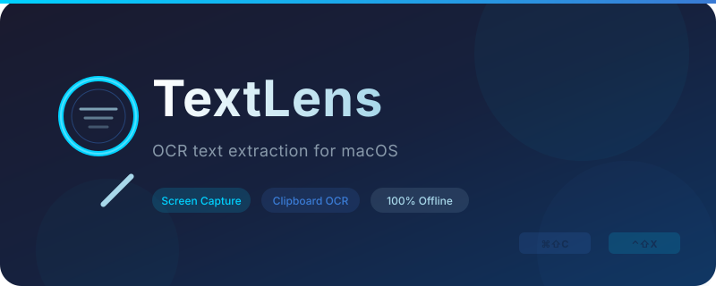

<p align="center">
  <picture>
    <source media="(prefers-color-scheme: light)" srcset="Resources/banner.svg">
    <source media="(prefers-color-scheme: dark)" srcset="Resources/banner.svg">
    
  </picture>
</p>

# TextLens

A macOS menu bar app for OCR text extraction — copy unselectable text from anywhere on your screen.

Inspired by [Text Lens](https://sindresorhus.com/text-lens) by Sindre Sorhus.

## Features

- 🎯 **Screen Capture OCR** — Select any area on screen to extract text
- 📋 **Clipboard OCR** — Extract text from images in your clipboard
- ⌨️ **Global Shortcuts** — Configurable keyboard shortcuts
- 🔒 **100% Offline & Private** — Everything runs locally. No network access.
- 🌐 **Multi-language** — Apple Vision auto-detects text in many languages including Thai, English, Japanese, Chinese, Korean, and more

## Requirements

- macOS 13 Ventura or later
- [Screen Recording permission](https://support.apple.com/en-us/102614) (required for screen capture)

## Installation

### Build from source

```bash
git clone https://github.com/dtmkeng/textlens
cd textlens
make run
```

This will build and launch TextLens in your menu bar.

### Manual build

```bash
make app     # Build TextLens.app
open build/TextLens.app
```

## Usage

1. Launch TextLens — it appears in the menu bar as 🔍
2. Use the menu bar menu or global shortcuts:

| Action | Shortcut |
|--------|----------|
| Capture Screen | `⌃⇧X` |
| OCR Clipboard | `⌘⇧C` |

3. Grant Screen Recording permission when prompted (required once)
4. Press the shortcut, select a region, and the text is instantly copied to your clipboard

## Default Shortcuts

You can customize shortcuts in Settings from the menu bar.

| Action | Default |
|--------|---------|
| Screen Capture OCR | `⌃⇧X` (Ctrl+Shift+X) |
| Clipboard OCR | `⌘⇧C` (Cmd+Shift+C) |

## Privacy

TextLens has **zero network access** — enforced via macOS entitlement. All OCR processing happens locally using Apple's Vision framework. Nothing leaves your device.

## Acknowledgments

- [**KeyboardShortcuts**](https://github.com/sindresorhus/KeyboardShortcuts) by Sindre Sorhus — Global keyboard shortcuts (MIT)

## License

MIT — see [LICENSE](LICENSE)

---

<p align="center">
  <a href="https://ko-fi.com/dtmkeng">
    
  </a>
</p>
